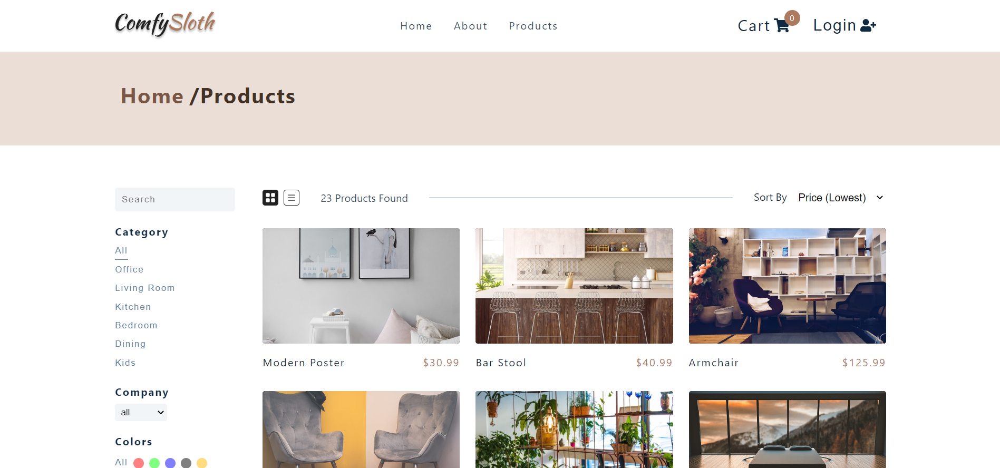

# Comfy Sloth

## Table of Contents
* [Overview](#overview)
* [Project Screenshot](#screenshots)
* [Installation](#installation)
* [Reflection](#reflection)
* [References](#references)
* [Author](#author)

# Overview
Comfy Sloth is an ECommerce website developed with React.js and React-Router.

## Screenshots
 

### You can watch Live demo [_here_](https://frolicking-selkie-2a3a0b.netlify.app/).

## Installation

Clone down this repository. You will need `node` and `npm` installed globally on your machine.  

Installation:

`npm install`  

To Start Server:

`npm start`  

To Visit App:

`localhost:3000`  

## Reflection

Comfy Sloth is Ecommerce build with React.js and styled components. I learned to use usereducer and apicontext to monage state. App also include filtering products based on price, color, category, company etc. Also, added cart functionality so when user add product to cart it automacially gets updated.

The technologies implemented in this project are React and Styled Component. I chose to use the `create-react-app` boilerplate to minimize initial setup and invest more time in diving into weird technological rabbit holes. 

## References
- [Styled Components](https://styled-components.com/)
- [React](https://reactjs.org/docs/getting-started.html)

## Author

[Website](https://kedarmakode.com/)

[Linkedin](https://www.linkedin.com/in/kedar-makode-9833321ab)

[Twitter](https://twitter.com/Kedar__98)

[Instagram]()

kedarmakode1598@gmail.com

